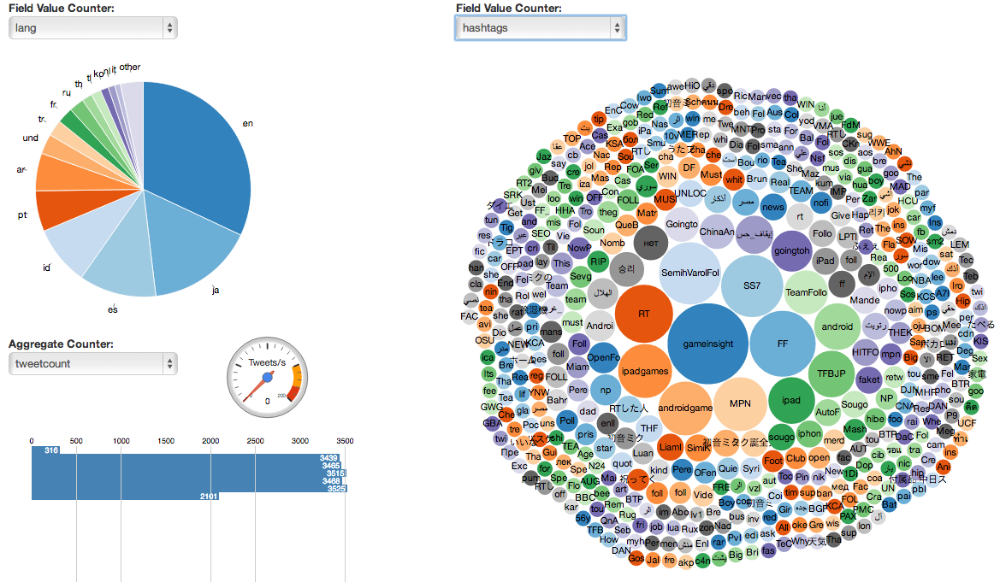

analytics-dashboard
===================

Standalone project which shows how you can use the D3 Javascript library to create visualizations for Spring XD counters.

Running the App
===============

All that's required to run the app is to serve up the `www` directory from a web server listening on port 9889. There are various ways you can do this. For example, if you have ruby installed, run

    ruby -run -e httpd ./www -p 9889

from the `analytics-dashboard` directory. Alternatively, if you have nginx installed, you can run the supplied `start-nginx.sh` script.

Then point your browser at [http://localhost:9889/dashboard.html](http://localhost:9889/dashboard.html).

The page is a simple dashboard divided in half. The right hand side will show a field value counter as a bubble chart. The left is divided into two panels, one which will show a field value counter as a pie chart, and one below it for an aggregate counter bar chart. The menus are populated by querying the Spring XD admin server, which is expected to also be running on localhost. Most likely, the menus will be empty initially, unless your admin server already contains some counters.

To provide some data for the output, start the XD server and then execute the following commands in the XD shell. Note that we're using `twitterstream` as a source which assumes the XD server `twitter.properties` config file is correctly populated with valid keys.

    xd:> stream create tweets --definition "twitterstream | log" --deploy false

    xd:> stream create tweetlang  --definition "tap:stream:tweets > field-value-counter --fieldName=lang"

    xd:> stream create tweetcount --definition "tap:stream:tweets > aggregatecounter"

    xd:> stream deploy tweets

Reloading the dashboard page should then show the populated menus.

You can also add another field value counter, to record twitter hashtags in the stream

    xd:> stream create tagcount --definition "tap:stream:tweets > field-value-counter --fieldName=entities.hashtags.text --counterName=hashtags"

Reload the page again and this should also appear in the field value counter menus. It's best displayed as a bubble chart.
