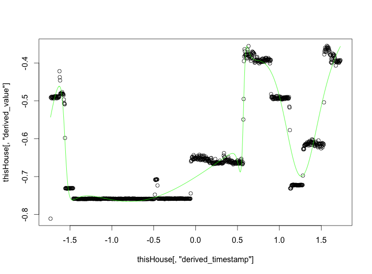

= Building the prediction model

This subfolder is all about generating the file `metaModel.pmml` (which has been checked in as well for convenience).

That PMML file contains several models, one per house that have been trained from the `agg_load_min_by_h.csv` file. This file is the result of aggregating over a period of 60s the load values of every plug, by averaging them over time and then summing them by house.



Obviously, in a real case scenario, one would train the model from a different dataset (maybe averages over the past day), but lacking such a dataset, this demo focuses on the fact that we can use a PMML model for prediction.

Selection of the correct house model is done at runtime by the PMML infrastructure, thanks to simple predicates of the form
```xml
        <SimplePredicate field="house" operator="equal" value="0"/>
```


== Steps to reproduce
In R, cd into this directory and run `neural_nets.R`. This will create several models `model-NNN.pmml` as well as save the scaling transformation in `transform.pmml`

Then, run the `mergePmml.groovy` script. This merges all the models using the `metaModel.pmml.skeleton` file, taking care of creating the predicate and adding the output transformation to un-scale the predicted value.